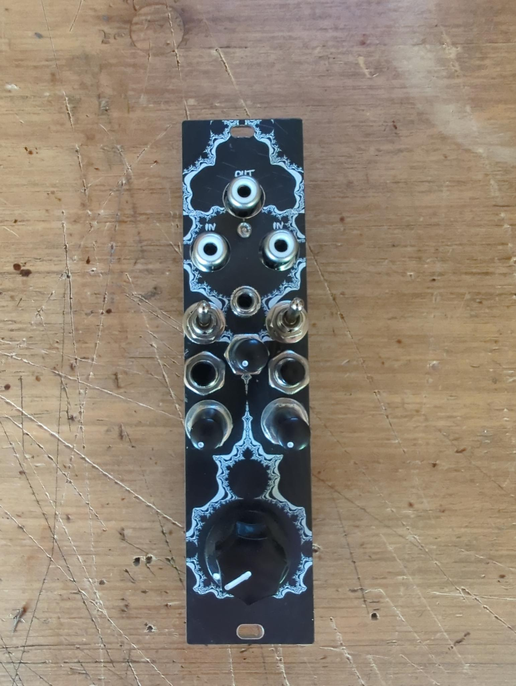
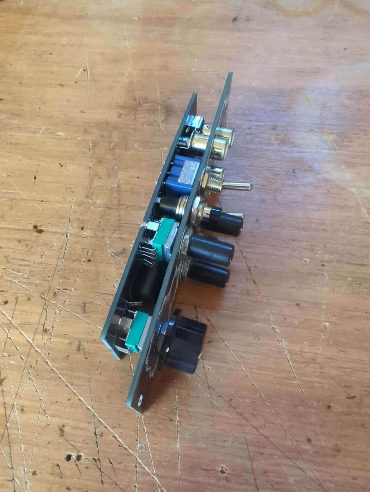

# Dirty Video Mixer
This is my implementation of Karl Klomp's Dirty Video Mixer, but with a few modifications:
- Vactrol based CV input to mix the two video signals. So you can use a LFO or another envelope to control the mix. (inspired from this project: https://www.reddit.com/r/modular/comments/olbu0t/i_made_a_thing_this_is_a_dirty_video_mixer_for/ )
- Added video signal attenuators for both inputs. (You can get more glitch effect before the crt monitor gets a black/blue screen if you turn one of the attenuators a bit down.)
- Added a push button to each video signal to turn it 100% on even if its attenuator or on/off switch is turned down.

If you don't know what a dirty video mixer is, just search for it on YouTube. There are many videos showing what glitchy and distorted video signals you can create with it.
I love to use it together with two RecurBoys as video inputs ( https://github.com/cyberboy666/recurBOY ), an envelope generated from an audio signal (with an envelope follower module) to control the mix/distortion and some old CRT monitors as output.

# Build
- Order the PCBs from the PCB manufacturer of your choice.
- Order the components from your favorite electronics supplier.
I used this momentary-push-buttons: https://de.aliexpress.com/item/1005007783283991.html?spm=a2g0o.order_list.order_list_main.4.35165c5f2uEEIS&gatewayAdapt=glo2deu
and these vactrols: https://de.aliexpress.com/item/32692736725.html?spm=a2g0o.order_list.order_list_main.9.20845c5f70I6Tp&gatewayAdapt=glo2deu
but you can also find them somewhere else ;)
- Solder the components to the PCB and mount the panel.

